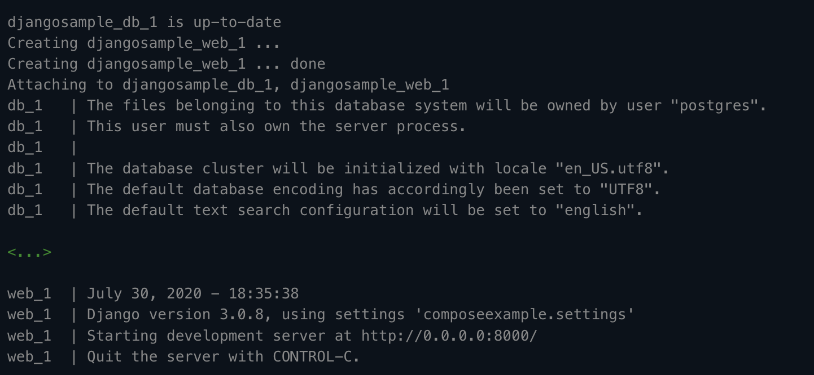
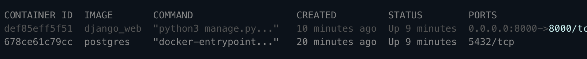

# Docker Compose Tutorial 


## Introduction 

This tutorial is about docker compose as the name suggests. The scope of this tutorial is talk about the motivation behind docker compose, how it works in brief and provide a quick guide to jump start on your local machine to see how it works.

First, one needs to really look at the name "compose". In the world of container orchestration, compose, just like a composer in music is all about composing, creating and architecting your containers. With the need of multiple containers, docker compose becomes a critical tool as well as powerful one while being simple to use. 

### Notes 

{} - indicates a placeholder variable for a command

## About Container Orchestration

Managing containers can often prove to be difficult in the context of scalability, distributed environments and having a lot of infrastructure. Docker compose provides the first building block of managing multiple containers. Some of its features include:

- Orchestrate multiple containers in a single machine in isolated environments
- Preserve state with docker 
- Only recreate containers when they have changed 
- Support for environment variables 
- Ability to automatically restart containers 


## Prerequisites & Getting Started

For this tutorial to work, you will need to have docker version 19.0 or above installed through docker for linux or desktop for mac or docker desktop for windows. Downloads to these can be found [here](https://docs.docker.com/get-docker/).

In terms of knowledge, this tutorial assumes basic knowledge of docker and containers. 

## Components of a Docker Compose file 

This section introduces various parts of a docker compose file. Let us take a look a sample docker compose file:

```
version: "3.9"
   
services:
  db:
    image: postgres
    volumes:
      - ./data/db:/var/lib/postgresql/data
    environment:
      - POSTGRES_DB=postgres
      - POSTGRES_USER=postgres
      - POSTGRES_PASSWORD=postgres
  web:
    build: .
    command: python manage.py runserver 0.0.0.0:8000
    ports:
      - "8000:8000"
    depends_on:
      - db
```

### Version 

The version of the docker compose file. Like any software and software system, compose files also have versions of updates docker made 

### Services

Under the services 

### Images/Build 

### Environment Variables 

### Volumes

### Ports 


## Tutorial - Running Docker Compose Locally 

### Initializing docker swarm 

```
docker swarm init
```

Sample Output:


This command initializes the swarm environment and makes the current device as a manager node. 

### View information about the nodes in the swarm 

```
docker node ls
```

Sample Output:


### Create a service 

```
docker service create --replicas {number of replicas} --name {service name} {image name}
```

Example: 

```
docker service create --replicas 1 --name helloworld nginx
```

We can also use a docker-compose file to define this: 

Sample Yaml:
```
version: "3"
services:
  dataservice:
    image: nginx:latest
    deploy:
      replicas: 3
    ports:
      - "3000:80"
```

The above yaml file defines a service: dataservice with 3 replicas and uses the latest nginx image while exposing the port 80 container to port 3000 of the host. 

To run such an example application you can clone this repo, make a swarm from the prevous commands and create a service through the following commands:

```
git clone https://github.com/abhinavtripathy/docker-swarm.git
docker stack deploy -c sample.yml app
```

Go to [localhost:3000](localhost:3000) to view the welcome page for nginx after running those commands. 

In general the format to create a service in swarm from a docker-compose yaml file is:

```
docker stack deploy -c {docker-compose file name} {docker compose app name}
```

Docker stack is a command used to deploy a docker-compose file in a swarm environment. 

### Check running services

```
docker service ls 
```

Sample Output:


### Scaling service

```
docker service scale {service name}={number of replicas}
```

Sample Output:


### Viewing state of worker nodes 

```
docker service ps {service name}
```

Sample Output:


### Remove a service 

```
docker service rm {service name}
```

### Quit Swarm Mode 

```
docker swarm leave
```

If the above doesn't work due to the current machining being a manager node. Use the following commmand:

```
docker swarm leave --force
```

## Docker Swarm Commands Cheatsheet 

```
#Start all services
docker compose up 

#Check the current state of the swarm with container information
docker info 

#View information of nodes in the swarm 
docker node ls 

#Create a service with the CLI
docker service create --replicas {number of replicas} --name {service name} {image name} 

#Create a service with docker-compose file
docker stack deploy -c {docker-compose file name} {docker compose app name} 

#Scaling a service
docker service scale {service name}={number of replicas}

#Check for running services 
docker service ls

#View state of worker nodes
docker service ps {service name}

#Remove a service
docker service rm {service name}

#Leave Swarm 
docker swarm leave 

#Leave swarm forcefully 
docker swarm leave --force
```

## Acknowledgements 

- [Docker Swarm Guide](https://gabrieltanner.org/blog/docker-swarm)
- [Official Docker Swarm Tutorial](https://docs.docker.com/engine/swarm/swarm-tutorial/)

